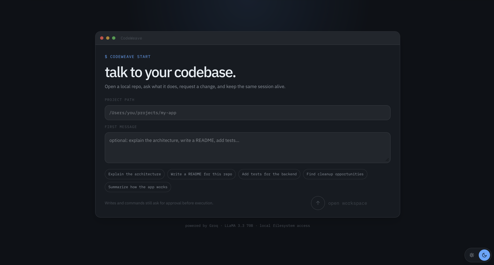
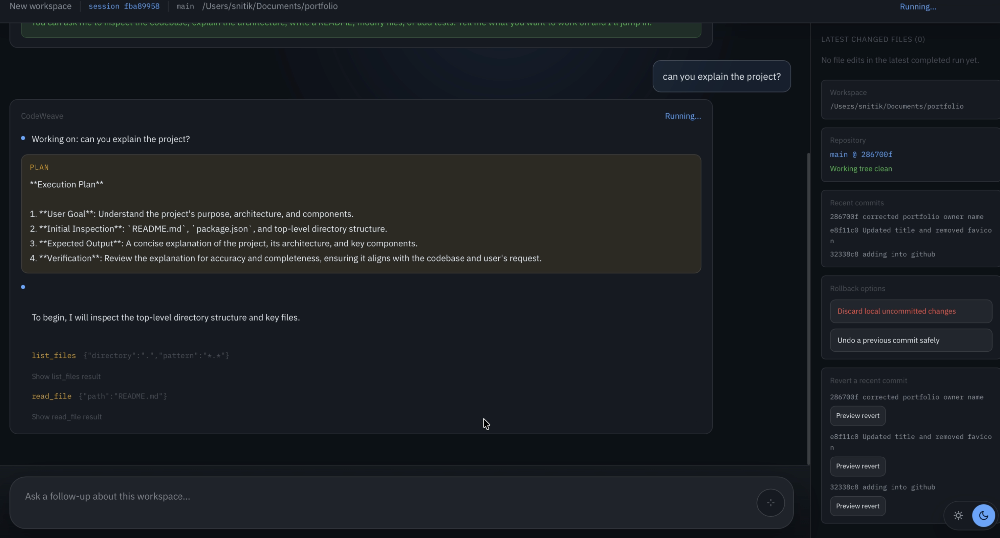
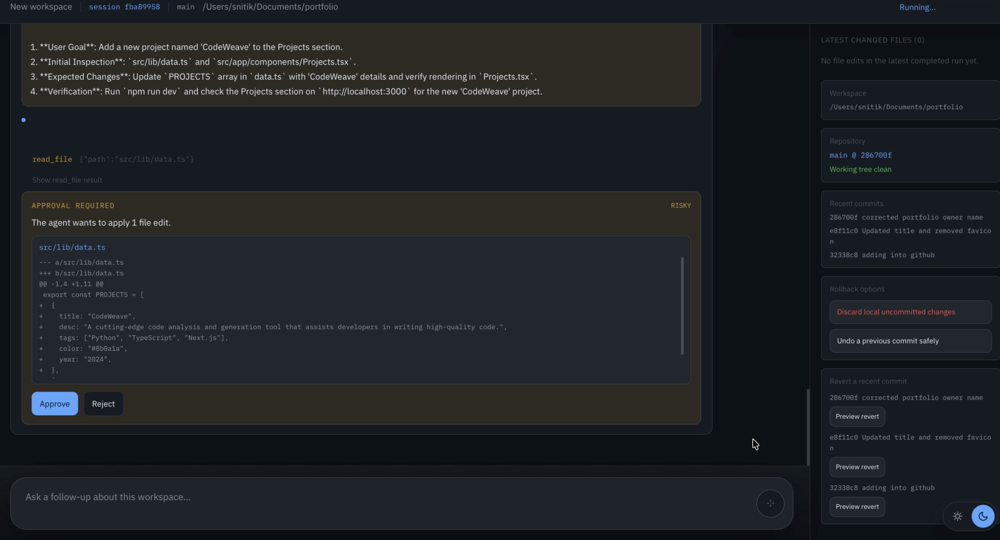

# RepoAgent

> A full-stack agentic coding assistant that connects to any local repository, reasons about the codebase through real tool calls, and streams every thought and file change live — built for transparent, iterative, human-in-the-loop AI development workflows.


🎥 **[Watch the Demo](https://github.com/sniiitik/RepoAgent-AI-Coding-Assistant/releases/latest)**

---

## What makes this different

Most AI coding tools are one-shot: you send a prompt, get a response, done. RepoAgent is built around **persistent sessions** — you connect a repository once and keep iterating in the same conversation:

```
"Write a README for this project"
→ agent reads all files, writes README.md, shows diff

"Now make it shorter"  
→ agent reads the README it just wrote, edits it

"Add a setup section with the actual install commands"
→ agent reads requirements.txt, infers the right commands, updates README
```

Every step — the agent's reasoning, each tool call, every file change — streams live to the UI. Nothing is hidden.

---

## Screenshots

### Home — connect any local project


### Live agent execution with streaming tool calls


### File diffs with approve / reject


---

## Features

- **Persistent chat sessions** — full conversation history per workspace, iterate with follow-ups
- **Real tool execution** — agent actually reads and writes files, doesn't just suggest changes
- **Live SSE streaming** — every thought, tool call, and file change appears as it happens
- **Human-in-the-loop** — approve or reject each file change before it's applied
- **Inline diffs** — before/after view for every file the agent modifies
- **Workspace sandbox** — agent is strictly confined to the chosen project directory
- **Light + dark themes** — Claude-inspired light mode, GitHub-inspired dark mode
- **Malformed tool-call recovery** — graceful handling when the model emits malformed tool syntax

---

## Architecture

```
┌─────────────────────────────────────────────────────────────────┐
│                        AGENTIC LOOP                              │
│                                                                  │
│  User message → messages[] → Groq LLM → tool_calls?             │
│                    ↑                         │                   │
│                    └──── tool results ───────┘                   │
│                    (loop until finish_reason=stop)               │
└─────────────────────────────────────────────────────────────────┘
                             │
                   SSE event stream
                             │
┌─────────────────────────────────────────────────────────────────┐
│                      NEXT.JS FRONTEND                            │
│                                                                  │
│  thought events  │  tool_call badges  │  file_changed diffs     │
│  fixed composer  │  session history   │  light/dark theme       │
└─────────────────────────────────────────────────────────────────┘
```

### High-level request flow

```
User → Next.js UI → POST /api/sessions/{id}/run → Agent loop → Tool execution → SSE stream → UI
```

### Session model

Each session tracks:

```python
{
  "session_id": "uuid",
  "workspace": "/absolute/path/to/project",
  "mode": "refactor | test | document",
  "busy": false,
  "messages": [],   # full conversation history
  "created_at": "...",
  "updated_at": "..."
}
```

Sessions persist in memory — a restart clears them. See [Known Limitations](#known-limitations).

---

## Tech Stack

| Layer | Technology | Why |
|---|---|---|
| Frontend | Next.js 16 + React 19 + TypeScript | App Router, fast iteration, type safety |
| Styling | CSS variables + global stylesheet | Custom themes without component library overhead |
| Backend | FastAPI (Python) | Async-native, auto Swagger docs at `/docs` |
| LLM | Groq API — LLaMA 3.3 70B | Free tier, ~300 tok/s, native tool-use |
| Streaming | Server-Sent Events | Unidirectional, works over plain HTTP, auto-reconnect |
| Validation | Pydantic v2 | Typed schemas for all requests and SSE event payloads |

---

## Project Structure

```
RepoAgent/
├── backend/
│   ├── main.py        # 3 endpoints: create session, get session, run turn
│   ├── agent.py       # Agentic loop — Groq + tool calls + SSE streaming
│   ├── tools.py       # 5 workspace-sandboxed tools + Groq tool schemas
│   ├── models.py      # Pydantic schemas for all events and API contracts
│   └── requirements.txt
│
└── frontend/
    ├── app/
    │   ├── page.tsx           # Workspace input + session creation
    │   └── session/page.tsx   # Chat UI + streamed event rendering
    └── components/
        ├── DiffViewer.tsx     # Before/after inline diff display
        ├── ThemeProvider.tsx  # Light/dark context
        └── ThemeToggle.tsx    # Theme switcher
```

---

## Getting Started

### Prerequisites

- Python 3.10+
- Node.js 18+
- A free [Groq API key](https://console.groq.com) — no credit card required

### 1. Clone

```bash
git clone https://github.com/sniiitik/RepoAgent-AI-Coding-Assistant.git
cd RepoAgent-AI-Coding-Assistant
```

### 2. Backend

```bash
cd backend
python3 -m venv .venv
source .venv/bin/activate
pip install fastapi uvicorn python-dotenv groq pydantic
```

```bash
echo "GROQ_API_KEY=your_key_here" > .env
uvicorn main:app --reload --port 8000
# Swagger UI → http://localhost:8000/docs
```

### 3. Frontend

```bash
cd ../frontend
npm install
npm run dev
# UI → http://localhost:3000
```

### 4. Use it

1. Open `http://localhost:3000`
2. Enter the **absolute path** to any local project
3. Type an initial goal or leave it blank and start chatting
4. Watch the agent stream its work live
5. Approve or reject each file change before it's applied
6. Continue with follow-up messages in the same session

---

## API Reference

### `POST /api/sessions`
Create a new session for a workspace.

```json
// Request
{ "workspace": "/absolute/path/to/project", "mode": "refactor" }

// Response
{ "session_id": "uuid", "workspace": "...", "mode": "refactor", "busy": false }
```

### `GET /api/sessions/{session_id}`
Fetch metadata for an existing session.

### `POST /api/sessions/{session_id}/run`
Run one turn and stream SSE events.

```json
// Request
{ "goal": "Write a professional README", "mode": "document" }
```

**SSE event types streamed back:**

| Event type | Payload | Description |
|---|---|---|
| `thought` | `{ content }` | Agent reasoning text |
| `tool_call` | `{ tool, args }` | Tool the agent is about to call |
| `tool_result` | `{ tool, result }` | What the tool returned |
| `file_changed` | `{ path, original, new_content }` | A file was written |
| `done` | `{ content, changed_files[], iterations }` | Turn complete |
| `error` | `{ content }` | Something went wrong |

---

## Tools

| Tool | Description |
|---|---|
| `list_files` | List files matching a glob — always the agent's first call |
| `read_file` | Read file content (size-limited to 100KB) |
| `write_file` | Create or overwrite a file, returns original for diff |
| `search_code` | Grep-style search across all files in workspace |
| `run_command` | Whitelisted commands only: `pytest`, `ls`, `grep`, `find`, `cat`, `head`, `tail` |

### Safety sandbox

Every path operation resolves relative to the workspace root and checks for escape attempts:

```python
def _safe(path: str) -> Path:
    resolved = (_WORKSPACE / path).resolve()
    if not str(resolved).startswith(str(_WORKSPACE)):
        raise PermissionError(f"Path '{path}' escapes workspace")
    return resolved
```

A path like `../../etc/passwd` is rejected before it touches the filesystem. This is a practical development safeguard, not a hardened security boundary.

---

## Design Decisions

### Why persistent sessions instead of one-shot runs?

Single-prompt agents are limited by context — you can't say "now make it shorter" because the agent doesn't remember what it just wrote. Persistent sessions accumulate the full `messages[]` array across turns, so the agent always has complete context of everything it's done in this workspace. This is the architectural choice that enables iterative workflows.

### Why SSE instead of WebSockets?

SSE is unidirectional (server → client) which is all an agent stream needs. It works over plain HTTP/1.1, requires no handshake, reconnects automatically on drop, and is trivially consumed by `fetch()` in the browser. WebSockets add bidirectional complexity that this use case doesn't justify.

### Why LLaMA 3.3 70B via Groq instead of GPT-4 or Claude?

Free tier with no credit card, ~300 tokens/second inference (fast enough to feel live in the UI), and native tool-use support. The LLM sits behind a single `client.chat.completions.create()` call — swapping to Claude Sonnet or GPT-4o in production is a one-line config change.

### Why a custom agent loop instead of LangChain?

The loop in `agent.py` is ~80 lines and fully transparent. Every iteration is visible and debuggable. LangChain abstractions make sense at scale but add significant overhead for a project where understanding the loop matters as much as running it. For an open-source project, readable code is a feature.

### Why malformed tool-call recovery?

LLaMA 3.3 70B occasionally emits tool call syntax in plain text rather than the structured format — especially on complex multi-step reasoning. The recovery path in `agent.py` parses these cases rather than crashing, which meaningfully improves reliability on longer sessions.

---

## Known Limitations

- **Sessions are in-memory** — a backend restart clears all session history. Production would use PostgreSQL or Supabase.
- **No parallelism** — tool calls execute sequentially. Parallel reads would speed up large codebase analysis.
- **100KB file limit** — files over 100KB are skipped. A chunked reading strategy would handle large files.
- **Single user** — no auth, no multi-tenancy. Anyone with the URL can create sessions.
- **Local only** — workspace must be a path on the machine running the backend. GitHub URL support would require a clone step.

---

## Why RepoAgent Exists

Most repository agents optimise for single prompts or hidden execution. RepoAgent is built around a more transparent workflow: connect a real local project, watch the agent work, keep the conversation going, and inspect the actual file changes before they're applied.

That makes it useful both as a coding assistant and as a learning interface for understanding how agentic systems actually behave in practice.

---

## Contributing

- Keep all backend tools workspace-safe — no path escapes
- Preserve the SSE event contract between backend and frontend
- Verify UI changes in both light and dark themes
- Keep the chat flow iterative — single-shot UX patterns are a regression

---

## License

MIT
